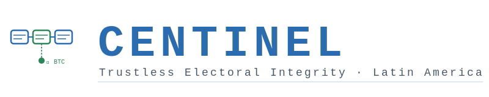

<p align="center">
  
</p>

# CENTINEL
### Trustless Electoral Integrity Verification — Latin America
*Verificación Confiable de Integridad Electoral — América Latina*

---

[](https://github.com/vectisdev/centinel/actions/workflows/ci.yml)
[](LICENSE)
[](pyproject.toml)
[](#validation-status)
[](docs/security/SECURITY-REVIEW.md)
[](#design-principles)
[](#supported-countries)

---

> Electoral authorities publish results that citizens must accept on trust.
> **CENTINEL eliminates that required trust** — permanently, cryptographically, at zero cost.

A single operator can audit a national election from a laptop.
Every capture is chained and signed cryptographically.
Any third party can verify — offline, independently, without your cooperation.
Bitcoin blockchain anchoring via OpenTimestamps is implemented. HN 2025 dataset anchored: `f17dbfe...` — see `tests/fixtures/hnd_2025/MERKLE_ROOT_HN2025.ots`.

> *Auditoría electoral independiente y reproducible, sin dependencia institucional, sin infraestructura dedicada y sin coste operativo. Un solo operador puede auditar una elección nacional desde un portátil.*

> **Neutrality disclaimer:** CENTINEL does not assert fraud. It detects statistical anomalies in publicly available electoral data and provides cryptographic proof of data integrity for independent human evaluation. The project is politically neutral, open-source, and reproducible.
>
> **Declaración de neutralidad:** CENTINEL no afirma fraude. Detecta anomalías estadísticas en datos electorales públicos y proporciona prueba criptográfica de integridad de datos para evaluación humana independiente. El proyecto es políticamente neutral, de código abierto y reproducible.

<!-- INSTANCE-STATUS-START -->

---

## Deploy in 3 steps — nothing to install

[](https://github.com/vectisdev/centinel/fork)

> Click above. GitHub creates **your own independent, private copy** of the tool in your account.

---

**Step 2 — Enable Actions** *(in your fork, once)*

Go to the **[Actions](../../actions)** tab of **your fork** and click:
> **"I understand my workflows, go ahead and enable them"**

---

**Step 3 — Run the Setup Wizard**

[](../../actions/workflows/setup-wizard.yml)

> In your fork: **Actions → Setup Wizard → "Run workflow"** → select your country → **"Run workflow"**

The wizard auto-configures everything: data repository, electoral authority endpoints, cryptographic seeds, and the visualization dashboard. Follow the Issue it opens for any remaining manual step.

**What you get after setup:**
→ 2–5 min election captures · Cryptographic hash chain · Public verification dashboard · Independent verify_chain.py script · P2P swarm-ready

<details>
<summary>Panel not showing after setup?</summary>

→ **[Settings → Pages](../../settings/pages)** → Source: **GitHub Actions** → Save

It will be available on the next push to `main`.
</details>

<!-- INSTANCE-STATUS-END -->

---

## Why CENTINEL?

| | Traditional NGO Observer | CENTINEL |
|--|--------------------------|----------|
| **Cost** | $10K – $500K per election | **Zero** — GitHub Actions free tier |
| **Independence** | Requires access, funding, accreditation | **Complete** — no permission needed |
| **Verifiability** | Reports and statements | **Cryptographic proof** — anyone can verify offline |
| **Scale** | Team of observers, weeks of planning | **1 operator, 1 laptop, 3-step setup** |
| **Real-time capability** | Post-election reports | **Engine validated on retroactive 2025 data; continuous live capture is the operational target for HN 2029** |
| **Censorship resistance** | Single organization = single point to pressure | **P2P swarm — no center to seize or bribe** |
| **Temporal proof** | None | **SHA-256 hash chain + Bitcoin anchoring** via OpenTimestamps (HN 2025 anchored) |
| **Replicability** | Closed methodology | **Every step reproducible by any third party** |

---

## What we've audited so far

### Honduras 2025 Presidential Election — Retroactive Forensic Analysis

> ⚠️ **Methodological transparency / Transparencia metodológica.**
> The following analysis is a **forensic post-mortem proof-of-concept** conducted on 64 CNE JSON files manually downloaded on **December 4, 2025**, after the electoral event concluded. This is a **retroactive analysis, not a live audit**. The cryptographic chain was constructed ex-post on the captured files and demonstrates the engine's detection capabilities on real electoral data — it does not constitute observational evidence of the live electoral process. Live continuous capture is the operational target for Honduras 2029.
>
> El siguiente análisis es una **demostración forense post-mortem** realizada sobre 64 archivos JSON del CNE descargados manualmente el **4 de diciembre de 2025**, tras concluir el evento electoral. Es un **análisis retroactivo, no una auditoría en vivo**. La cadena criptográfica se construyó ex-post sobre los archivos capturados y demuestra las capacidades de detección del motor sobre datos electorales reales — no constituye evidencia observacional del proceso electoral en vivo. La captura continua en vivo es el objetivo operacional para Honduras 2029.

CENTINEL applied its forensic engine retroactively to **64 original JSON files from the CNE** (elecciones 30/11/2025). These are the same files published by the State — unmodified, no privileged access required. The forensic engine detected:

| Finding | Detail |
|---------|--------|
| **13-hour communication blackout** | Dec 3 22:00 → Dec 4 11:06 — no data published overnight, -0.504pp trend shift |
| **Physically implausible resolution rate** | 2,346 inconsistent acts resolved at 39.15 actas/min (threshold: 10/min) |
| **Prolonged stagnation** | 17 events where inconsistent act count froze for 8+ consecutive cycles |
| **Progressive injection pattern** | 6 consecutive low-delta cycles while >1,000 inconsistent acts remained in backlog |
| **41 communication gaps** | Including 6 overnight blackouts exceeding 10 hours each |

**Reproduce it yourself:**
```bash
make reproduce-2025-audit
```

> Raw data: `tests/fixtures/hnd_2025/` (64 JSON files from CNE)
> Forensic script: `scripts/forensic_hnd_2025.py`
> Detection engine: `src/auditor/inconsistent_acts.py`

**Verify the hash chain independently:**
```bash
python verify/verify_chain.py tests/fixtures/hnd_2025/
```

*CENTINEL does not assert fraud. It detects statistical anomalies and provides cryptographic proof of data integrity for independent human evaluation.*

*CENTINEL no afirma fraude. Detecta anomalías estadísticas y proporciona prueba criptográfica de integridad de datos para evaluación humana independiente.*

> **Scope clarification / Aclaración de alcance.** CENTINEL is positioned as **public electoral evidence preservation infrastructure** — not as an electoral authority, observer, or arbiter of disputes. The system captures, chains, and anchors publicly published data so that any third party can verify it offline, independently, and without the project's cooperation. The interpretation of detected anomalies is reserved for qualified observers, courts, and the public.
>
> CENTINEL se posiciona como **infraestructura de preservación de evidencia electoral pública** — no como autoridad electoral, observador ni árbitro de disputas. El sistema captura, encadena y ancla datos publicados públicamente para que cualquier tercero pueda verificarlos offline, de forma independiente y sin cooperación del proyecto. La interpretación de las anomalías detectadas queda reservada para observadores calificados, tribunales y la opinión pública.

---

## Supported Countries

| Country | Code | Electoral Authority | Status |
|---------|------|---------------------|--------|
| 🇭🇳 Honduras | `HN` | Consejo Nacional Electoral (CNE) | ✅ Production-ready — piloted on 2025 general election |
| 🇬🇹 Guatemala | `GT` | Tribunal Supremo Electoral (TSE) | 🔧 Configured — awaiting field test |
| 🇸🇻 El Salvador | `SV` | Tribunal Supremo Electoral (TSE) | 🔧 Configured — awaiting field test |
| 🇳🇮 Nicaragua | `NI` | Consejo Supremo Electoral (CSE) | 🔧 Configured — awaiting field test |
| 🇲🇽 Mexico | `MX` | Instituto Nacional Electoral (INE) | 🔧 Configured — awaiting field test |
| 🇨🇴 Colombia | `CO` | Registraduría Nacional | 🔧 Configured — awaiting field test |

Adding a new country requires only a preset in [`src/centinel/countries.py`](src/centinel/countries.py).

---

## What it solves

Electoral authorities publish results that citizens must accept on trust. CENTINEL eliminates that required trust: it captures published data, chains it cryptographically, and allows any third party to verify — reproducibly and offline — that data was not altered after publication.

| Property | Guarantee |
|----------|-----------|
| **Reproducibility** | SHA-256 chain + Merkle root, verifiable offline by anyone |
| **Independent verification** | `verify_chain.py` — zero-dependency script any third party can run offline to verify the entire hash chain |
| **Independence** | Operator needs no permission or cooperation from the authority |
| **Resilience** | P2P federation — no single point of failure or capture |
| **Temporal immutability** | SHA-256 chained snapshots + Bitcoin anchoring via OpenTimestamps (HN 2025 anchored) |
| **Neutrality** | Reports verifiable facts only — no political interpretation |
| **Ethical scraping** | Token-bucket rate limiting + jitter + gossip-first swarm design — the full swarm behaves as at most one visitor to the audited site |

> **Anti-DDoS by design:** If a node receives a cryptographically-signed snapshot from a peer, it skips the scrape entirely. The entire witness swarm never exceeds the footprint of a single polite visitor — your infrastructure cannot cause harm to the audited site.

---

## Design principles

Three decisions are non-negotiable — they determine whether the tool remains useful under pressure:

- **Zero cost.** Anyone — student, journalist, civil society organization — can operate it without budget or authorization.
- **Resilience.** No central point to seize, block, or bribe.
- **Survival.** The protocol persists and replicates even if its author disappears; the license and documentation guarantee it.

---

## Swarm / Federation

Each fork is a fully independent node. Nodes can optionally join a **witness swarm** — sharing cryptographically signed snapshots over a gossip protocol without any central coordinator:

- **Join**: Fork → enable Actions → run wizard → the wizard auto-discovers existing peers
- **Leave**: disable master switch → node gracefully exits; peers discard it after timeout
- **Anti-DDoS**: gossip-first design means if a node receives a valid signed snapshot from a peer, it does not scrape the source again. The entire swarm never exceeds the footprint of a single polite visitor.
- **OpenTimestamps**: implemented. Any node anchors to Bitcoin's blockchain for free. HN 2025 dataset anchored: `MERKLE_ROOT_HN2025.ots`

---

## Operation

```bash
poetry install

make wizard                  # Guided interactive setup (recommended)
centinel panel show          # System status
centinel snapshot            # One-shot capture and verification
centinel cron --interval 30s # Continuous automated capture
```

---

## Defense architecture

CENTINEL applies defense in depth: each layer mitigates a distinct class of threat.

| Layer | Function | Threat mitigated |
|-------|----------|-----------------|
| Distributed attestation | Cross-confirmation between witnesses | Single witness compromised |
| Transit encryption | ChaCha20-Poly1305 | Interception / MITM |
| Non-deterministic timing | Capture jitter | Predictive selective blocking |
| Auto-regeneration | Resync from replicas | Local state manipulation |
| Kill switch | Freeze on active attack | Real-time compromise |

→ [Defense specification](docs/architecture/ANIMAL-DEFENSES-ES.md) · [Architecture and theorems T1–T4](docs/architecture/ARCHITECTURE.md)

---

## Cryptographic stack

| Primitive | Use |
|-----------|-----|
| SHA-256 chained hash | Snapshot integrity chain |
| Ed25519 (EdDSA) | Witness signatures, operator keypairs |
| Fernet (AES-128-CBC + HMAC-SHA256) | Encrypted backups and checkpoints |
| HKDF-SHA256 | Checkpoint key derivation |
| PBKDF2-SHA256 (600k iterations) | Admin seed hashing |
| OpenTimestamps / Bitcoin | External temporal immutability anchor — HN 2025 dataset anchored |
| Merkle tree (SHA-256) | Batch snapshot anchoring |

---

## Validation status

| Axis | Status |
|------|--------|
| Cryptographic audit (theorems T1–T4) | Complete — verifiable in code |
| Test suite | 526 / 526 passing |
| Independent academic validation | Initiated — working paper in preparation with Prof. Devis Alvarado (UPNFM). Statistical conventions document under review. |
| Retroactive forensic pilot | Completed — 64 CNE JSON files (HN 2025), manually downloaded 2025-12-04 |
| Live operational pilot | Pending — targeting an intermediate electoral event in 2026–2027 prior to HN 2029 |
| False positive analysis | 500-run validation — [results published](docs/research/FALSE_POSITIVE_ANALYSIS.md) |
| Statistical conventions | Unified — [see STATISTICAL_CONVENTIONS.md](docs/stats/STATISTICAL_CONVENTIONS.md) |

Version **0.1 — pre-pilot.** Cryptographic core stable; academic review initiated with UPNFM (Universidad Pedagógica Nacional Francisco Morazán).

---

## Data architecture

CENTINEL separates code (this repository) from captured electoral data (`centinel-data`). Data is published automatically to an independent repository on each capture — any auditor can verify it without running the engine.

**Data repository:** <!-- CENTINEL_DATA_URL -->*(auto-configured when you fork)*<!-- /CENTINEL_DATA_URL -->

**Visualization panel:** <!-- CENTINEL_PAGES_URL -->*(auto-activated when you fork)*<!-- /CENTINEL_PAGES_URL -->

→ [Code/data separation architecture](docs/operations/DATA-REPOS.md) · [Setup guide](docs/operations/SETUP-GUIDE.md) · [Visualization panel](docs/operations/PAGES-GUIDE.md)

---

## Documentation

| Document | Audience |
|----------|----------|
| [QUICKSTART.md](docs/guides/QUICKSTART.md) | Operators — getting started |
| [ARCHITECTURE.md](docs/architecture/ARCHITECTURE.md) | Technical reviewers — design and theorems |
| [SECURITY-REVIEW.md](docs/security/SECURITY-REVIEW.md) | Security auditors — threat model |
| [METHODOLOGY.md](docs/research/METHODOLOGY.md) | Academics — methodological foundation |
| [STATISTICAL_CONVENTIONS.md](docs/stats/STATISTICAL_CONVENTIONS.md) | Statisticians — unified Z-score and Benford conventions |
| [OPERATOR-RUNBOOKS.md](docs/operations/OPERATOR-RUNBOOKS.md) | Operators — step-by-step procedures |
| [LEGAL-AND-OPERATIONAL-BOUNDARIES.md](docs/legal/LEGAL-AND-OPERATIONAL-BOUNDARIES.md) | Legal framework and operational limits |
| [docs/](docs/) | Full documentation index |

---

## For grant reviewers and bounty programs

CENTINEL is designed for zero operating cost, maximum verifiability, and AGPL-3.0 licensing that prevents capture or privatization.

**Relevant materials:**
- [Theory of Change](docs/architecture/THEORY_OF_CHANGE.md) — impact logic model
- [Methodology](docs/research/METHODOLOGY.md) — 25+ statistical detectors, academic foundation
- [Statistical Conventions](docs/stats/STATISTICAL_CONVENTIONS.md) — unified Z-score and Benford methodology
- [OTF Concept Note IFF-2026-06](docs/grants/OTF_ConceptNote_IFF2026.md) — concept note lista para enviar
- [Budget Narrative](docs/grants/BUDGET_NARRATIVE.md) — grant budget breakdown
- [Institutional Readiness](docs/grants/INSTITUTIONAL_READINESS.md) — readiness for multilateral observer engagement
- [Roadmap](docs/grants/ROADMAP.md) — feature and deployment roadmap
- [False Positive Analysis](docs/research/FALSE_POSITIVE_ANALYSIS.md) — 500-run validation

**Suitable for:** Gitcoin · Open Society Foundations · NDI / IRI · OAS · NSF · Immunefi security bounties · Open Technology Fund (OTF)

→ [Full grants documentation](docs/grants/)

---

## License

**GNU AGPL-3.0.** Free, auditable, and redistribution-guaranteed software: any derivative must remain open. This license is deliberate — it ensures CENTINEL cannot be captured, closed, or privatized by any actor, public or private.

---

**CENTINEL** · Electoral auditing as a citizen right, not an institutional privilege · `vectisdev`

<!-- FORK-GUIDE-START -->
---

## Want your own instance? / ¿Quieres tu propia instancia?

Fork → enable Actions → run Setup Wizard → done. Your instance includes a public data repository (`centinel-data`), a GitHub Pages visualization dashboard, and continuous verifiable capture — no servers, no operating cost.

Full details: [docs/operations/SETUP-GUIDE.md](docs/operations/SETUP-GUIDE.md)
<!-- FORK-GUIDE-END -->
